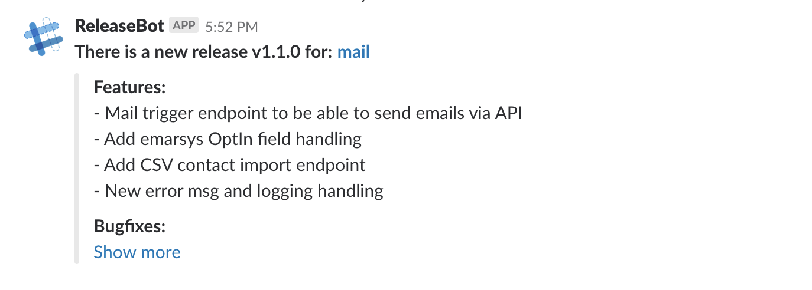

# release-bot

A bot that converts GitLab tag pushes to Slack messages

## Installation
- copy the `sample.toml` from `/conf` and edit it to your needs
- run `release-bot -c config.toml` - the `-c` flag can be ommited if there is a `config.toml` in the same directory as the binary
- Point the gitlab webhook to `http://your.domain/hooks/gitlab`

## Features
Currently the release-bot only understands `gitlab tag pushes` and `slack` notifications

## Demo
